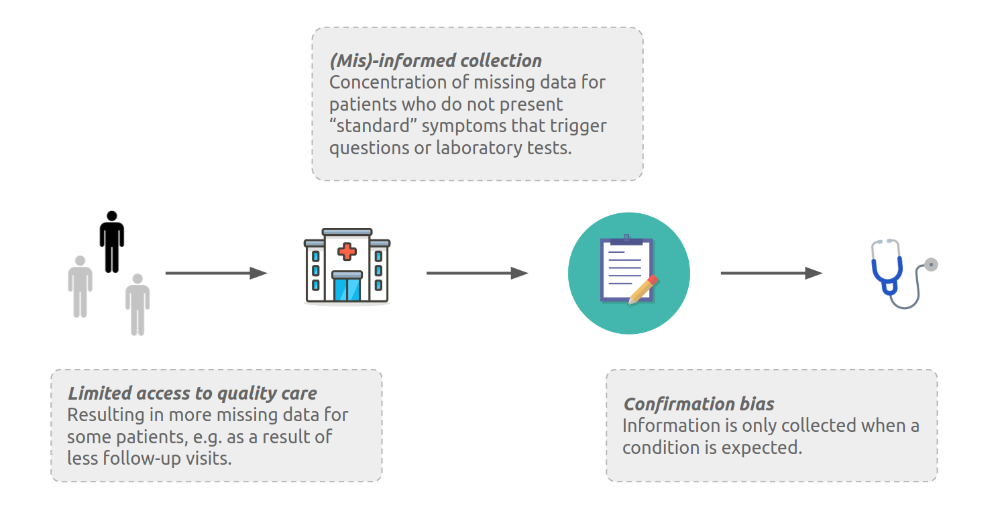
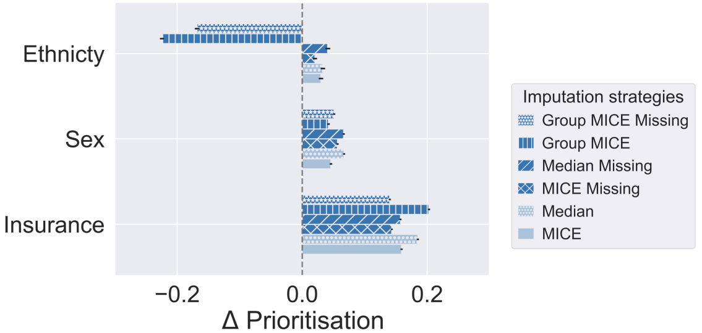
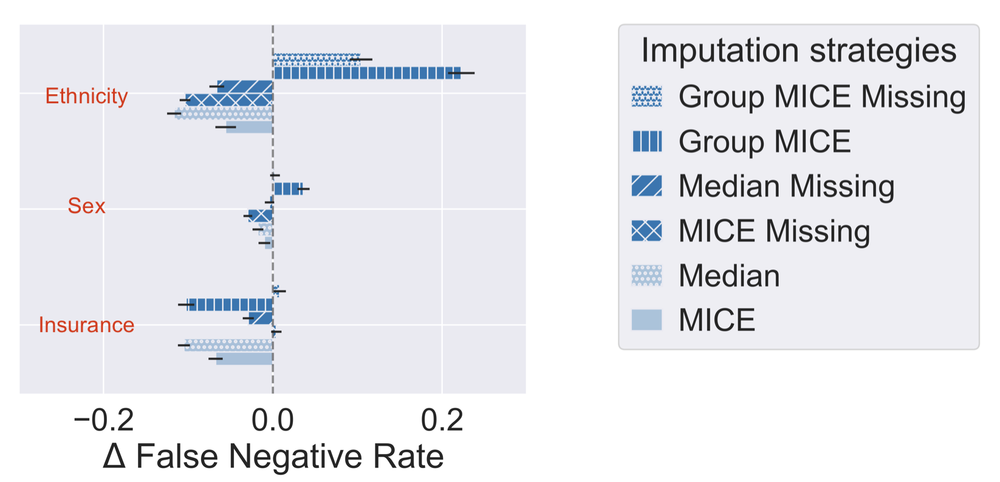

# Reproducibility of Clinical Presence Fairness

This repository allows to reproduce results from the paper [Imputation Strategies Under Clinical Presence: Impact on Algorithmic Fairness](https://arxiv.org/abs/2208.06648). This paper explores the importance of imputation on algorithmic fairness. 2 folders in this repository allow for the reproducibility of the paper's result:

>📋  Synthetic: This folder contains 2 files: `utils.py` and `synthetic.ipynb`. \
`utils.py` contains all the functions.\
`synthetic.ipynb` contains methods to create synthetic sample results by enforcing the **clinical presence** patterns identified in the paper. The following figure introduces the 3 different scenarios of clinical presence, i.e. the complex interaction between patients and healthcare, that can result in group-specific missingness patterns.
\
Since we will be using the MIMIC-III dataset, it is not necessary to run `synthetic.ipynb`.

>📋  Mimic: This folder contains 3 notebooks: `preprocessing.ipynb` to extract the labratory tests and the study population, `experiment.ipynb` to run the different imputation pipelines, and `analysis_group.ipynb` to compare the pipeline performances.

## Requirements

To install requirements:

```setup
pip install -r requirements.txt
```

## Training

To conduct the data cleaning, run through notebook `preprocessing.ipynb`. Change the `path` in the first cell to your local path of the MIMIC-III dataset. This notebook save the cleaned data to the `mimic/data` folder. \

Then to train the model(s) in the paper and get imputation results, run through notebook `mimic/experiment.ipynb`. To get the same result, use the provided seed `1234`. This notebook uses the cleaned data from the first step in the `mimic/data` folder, and saves the computation results to the `mimic/result` folder.


## Evaluation

To evaluate the imputation results from last step, run through notebook `mimic/eanalysis groups.ipynb`. This notebook analyzes the results from the `mimic/result` folder.


## Results

Our model reproduced the prioritisation rates and false negative rates reported in the paper and graphed their equal performance measures.\

Prioritisation:\
|           | MICE     |          | Medium   |          | MICE Missing |          | Medium Missing |          | Group MICE |          | Group MICE Missing |          |
|-----------|----------|----------|----------|----------|--------------|----------|----------------|----------|------------|----------|--------------------|----------|
|           | Mean     | Std      | Mean     | Std      | Mean         | Std      | Mean           | Std      | Mean       | Std      | Mean               | Std      |
| Insurance | 0.162673 | 0.009045 | 0.187514 | 0.009302 |     0.141525 | 0.008407 |       0.153618 | 0.008632 |   0.209102 | 0.009174 |           0.145604 | 0.008347 |
| Sex       | 0.045265 | 0.009971 | 0.064422 | 0.008663 |     0.059543 | 0.008058 |       0.065030 | 0.008506 |   0.043416 | 0.010215 |           0.054522 | 0.008731 |
| Ethnicty  | 0.014721 | 0.018890 | 0.036142 | 0.018418 |     0.015874 | 0.017522 |       0.038465 | 0.019374 |  -0.223216 | 0.016868 |          -0.195926 | 0.018049 |

\

False Negative Rate:\
|           | MICE      |          | Medium    |          | MICE Missing |          | Medium Missing |          | Group MICE |          | Group MICE Missing |          |
|-----------|-----------|----------|-----------|----------|--------------|----------|----------------|----------|------------|----------|--------------------|----------|
|           | Mean      | Std      | Mean      | Std      | Mean         | Std      | Mean           | Std      | Mean       | Std      | Mean               | Std      |
| Insurance | -0.053620 | 0.042461 | -0.106927 | 0.036032 |    -0.001871 | 0.032924 |      -0.037452 | 0.033104 |  -0.108763 | 0.049098 |           0.000878 | 0.036885 |
| Sex       | -0.007401 | 0.035240 | -0.020688 | 0.031939 |    -0.031552 | 0.028177 |      -0.002487 | 0.027498 |   0.037547 | 0.037242 |           0.000290 | 0.030291 |
| Ethnicty  | -0.028514 | 0.063142 | -0.115439 | 0.042394 |    -0.084786 | 0.040369 |      -0.065037 | 0.044340 |   0.226627 | 0.080410 |           0.127493 | 0.069135 |

\

